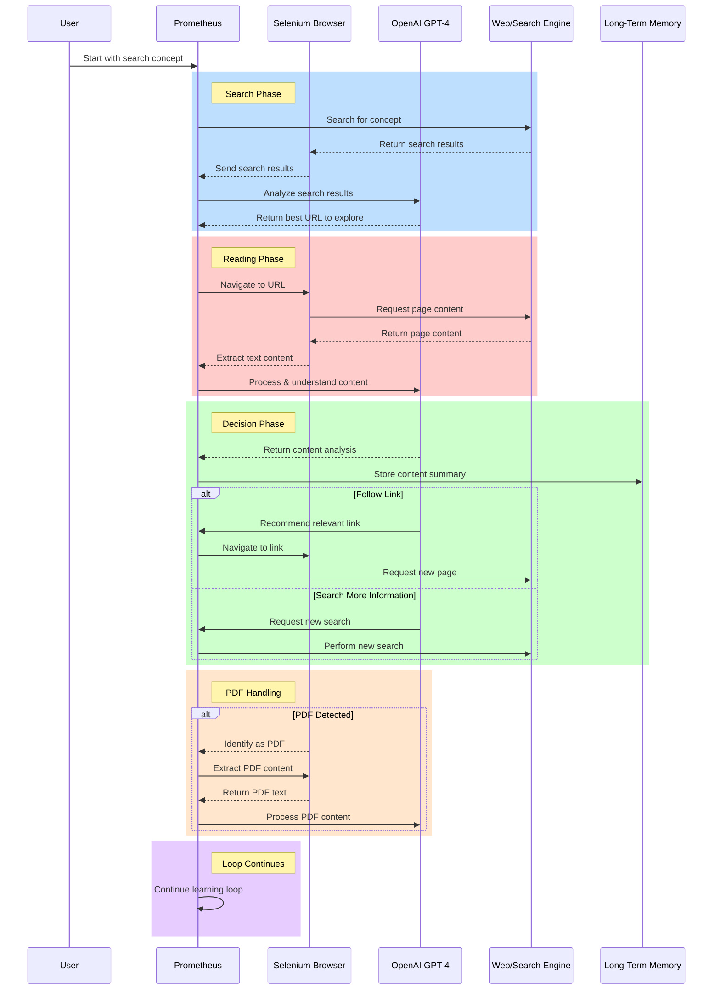

```mermaid
sequenceDiagram
    participant User
    participant Prometheus
    participant Browser as Selenium Browser
    participant GPT4 as OpenAI GPT-4
    participant Web as Web/Search Engine
    participant Memory as Long-Term Memory

    User->>Prometheus: Start with search concept
    
    rect rgb(191, 223, 255)
    note right of Prometheus: Search Phase
    Prometheus->>Web: Search for concept
    Web-->>Browser: Return search results
    Browser-->>Prometheus: Send search results
    Prometheus->>GPT4: Analyze search results
    GPT4-->>Prometheus: Return best URL to explore
    end

    rect rgb(255, 204, 204)
    note right of Prometheus: Reading Phase
    Prometheus->>Browser: Navigate to URL
    Browser->>Web: Request page content
    Web-->>Browser: Return page content
    Browser-->>Prometheus: Extract text content
    Prometheus->>GPT4: Process & understand content
    end

    rect rgb(204, 255, 204)
    note right of Prometheus: Decision Phase
    GPT4-->>Prometheus: Return content analysis
    Prometheus->>Memory: Store content summary
    
    alt Follow Link
        GPT4->>Prometheus: Recommend relevant link
        Prometheus->>Browser: Navigate to link
        Browser->>Web: Request new page
    else Search More Information
        GPT4->>Prometheus: Request new search
        Prometheus->>Web: Perform new search
    end
    end

    rect rgb(255, 230, 204)
    note right of Prometheus: PDF Handling
    alt PDF Detected
        Browser-->>Prometheus: Identify as PDF
        Prometheus->>Browser: Extract PDF content
        Browser-->>Prometheus: Return PDF text
        Prometheus->>GPT4: Process PDF content
    end
    end

    rect rgb(230, 204, 255)
    note right of Prometheus: Loop Continues
        Prometheus->>Prometheus: Continue learning loop
    end
``` 