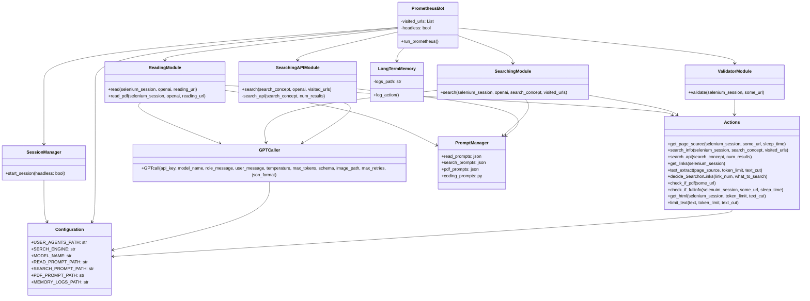

```mermaid
classDiagram
    class PrometheusBot {
        +run_prometheus()
        -visited_urls: List
        -headless: bool
    }
    
    class SessionManager {
        +start_session(headless: bool)
    }
    
    class ReadingModule {
        +read(selenium_session, openai, reading_url)
        +read_pdf(selenium_session, openai, reading_url)
    }
    
    class SearchingModule {
        +search(selenium_session, openai, search_concept, visited_urls)
    }
    
    class SearchingAPIModule {
        +search(search_concept, openai, visited_urls)
        -search_api(search_concept, num_results)
    }
    
    class ValidatorModule {
        +validate(selenium_session, some_url)
    }
    
    class GPTCaller {
        +GPTcall(api_key, model_name, role_message, user_message, temperature, max_tokens, schema, image_path, max_retries, json_format)
    }
    
    class Configuration {
        +USER_AGENTS_PATH: str
        +SERCH_ENGINE: str
        +MODEL_NAME: str
        +READ_PROMPT_PATH: str
        +SEARCH_PROMPT_PATH: str
        +PDF_PROMPT_PATH: str
        +MEMORY_LOGS_PATH: str
    }
    
    class LongTermMemory {
        -logs_path: str
        +log_action()
    }
    
    class Actions {
        +get_page_source(selenium_session, some_url, sleep_time)
        +search_info(selenium_session, search_concept, visited_urls)
        +search_api(search_concept, num_results)
        +get_links(selenium_session)
        +text_extract(page_source, token_limit, text_cut)
        +decide_SearchorLinks(link_num, what_to_search)
        +check_if_pdf(some_url)
        +check_if_fullinfo(selenuim_session, some_url, sleep_time)
        +get_html(selenium_session, token_limit, text_cut)
        +limit_text(text, token_limit, text_cut)
    }
    
    class PromptManager {
        +read_prompts: json
        +search_prompts: json
        +pdf_prompts: json
        +coding_prompts: py
    }
    
    PrometheusBot --> SessionManager
    PrometheusBot --> ReadingModule
    PrometheusBot --> SearchingModule
    PrometheusBot --> SearchingAPIModule
    PrometheusBot --> ValidatorModule
    PrometheusBot --> LongTermMemory
    
    ReadingModule --> GPTCaller
    ReadingModule --> Actions
    ReadingModule --> PromptManager
    
    SearchingModule --> GPTCaller
    SearchingModule --> Actions
    SearchingModule --> PromptManager
    
    SearchingAPIModule --> GPTCaller
    SearchingAPIModule --> PromptManager
    
    ValidatorModule --> Actions
    
    SessionManager --> Configuration
    
    PrometheusBot --> Configuration
    GPTCaller --> Configuration
    Actions --> Configuration
``` 