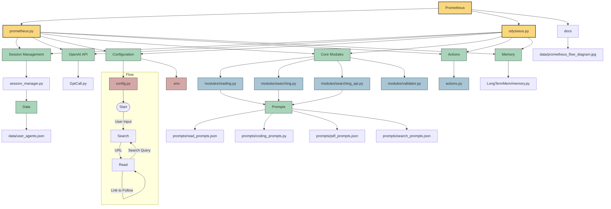

```mermaid
graph TD
    %% Main Application
    A[Prometheus] --> B[prometheus.py]
    A --> C[odysseus.py]
    
    %% Core Components
    B --> D[Session Management]
    C --> D
    D --> D1[session_manager.py]
    
    %% API Integration
    B --> E[OpenAI API]
    C --> E
    E --> E1[GptCall.py]
    
    %% Configuration
    B --> F[Configuration]
    C --> F
    F --> F1[config.py]
    F --> F2[.env]
    
    %% Core Functionality
    B --> G[Core Modules]
    C --> G
    G --> G1[modules/reading.py]
    G --> G2[modules/searching.py]
    G --> G3[modules/searching_api.py]
    G --> G4[modules/validator.py]
    
    %% Actions
    B --> H[Actions]
    C --> H
    H --> H1[actions.py]
    
    %% Prompts
    G1 --> I[Prompts]
    G2 --> I
    G3 --> I
    I --> I1[prompts/read_prompts.json]
    I --> I2[prompts/coding_prompts.py]
    I --> I3[prompts/pdf_prompts.json]
    I --> I4[prompts/search_prompts.json]
    
    %% Memory
    B --> J[Memory]
    C --> J
    J --> J1[LongTermMem/memory.py]
    
    %% Data
    D1 --> K[Data]
    K --> K1[data/user_agents.json]
    
    %% Flow Diagram
    A --> L[docs]
    L --> L1[data/prometheus_flow_diagram.jpg]
    
    %% Main Flow
    subgraph Flow
        direction LR
        F1 --> Start([Start])
        Start --> |"User Input"| Search
        Search --> |"URL"| Read
        Read --> |"Link to Follow"| Read
        Read --> |"Search Query"| Search
    end
    

    classDef mainComponents fill:#f9d77e,stroke:#333,stroke-width:2px;
    classDef modules fill:#a8d5ba,stroke:#333,stroke-width:1px;
    classDef config fill:#d5a8a8,stroke:#333,stroke-width:1px;
    classDef tools fill:#a8c6d5,stroke:#333,stroke-width:1px;
    class A,B,C mainComponents;
    class D,E,F,G,H,I,J,K modules;
    class F1,F2 config;
    class G1,G2,G3,G4,H1 tools;
``` 