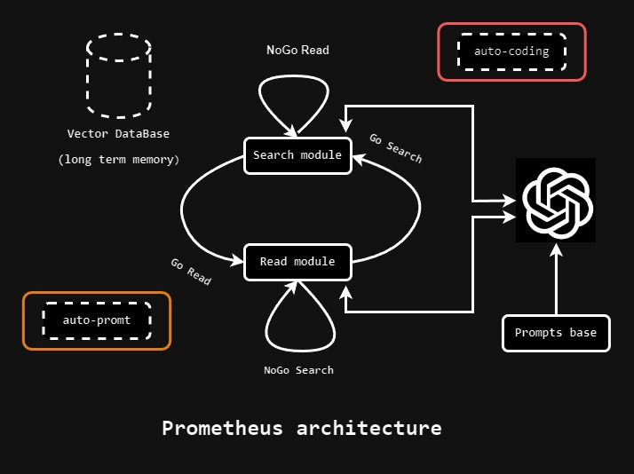
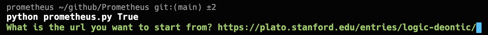

# **Prometheus**
#### **We are entering the age of Internet bots empowered by LLMs (LLMbots). Prometheus is a testbed for such powerful bots**. 
LLMbots are agents, but they are not limited to a specific task, and their inherent goal is to learn, explore and evolve in the most extensive information space ever created by humans - the Internet. They can become great but, at the same time, very dangerous. They are hybrids of human-like intelligence (LLM) and the speed and efficiency of computer programs.

- Prometheus reads content from a website, reflects on what it read and then decides what to do next: follow some links from the page or search the web for additional information. The bot is powered by OpenAI's GPT-4-Turbo model.
The bot is in its infancy: no memory, no ability to modify its prompts, and no ability to modify its source code. (dotted lines). Orange and red lines indicate **danger zone**.

- Prometheus is full of dirty tricks and magic numbers in the current version.
- I do not use librieries like [LangChain](https://python.langchain.com/docs/get_started/introduction) to fully control the bot's behavior.
## Installation
1. **Clone the repository**: `git clone git@github.com:bqpro1/Prometheus.git`
2. **Install chrome driver (I did not test other drivers).**
    - For Windows, download the driver from [here](https://googlechromelabs.github.io/chrome-for-testing/), and after extracting the zip file, copy the chromedriver.exe to the Windows folder.
    - For macOS, the best way is to use brew: `brew install --cask chrome driver`. I also had to do [this](https://stackoverflow.com/questions/60362018/macos-catalinav-10-15-3-error-chromedriver-cannot-be-opened-because-the-de).
3. **Create a virtual environment (I used conda)**: `conda create -n prometheus python=3.11`. 
4. **Install the requirements: `pip install -r requirements.txt`**.

## Usage
1. **Paste your OpneAI API key in the `.env` file**.
2. **Activate the virtual environment**: `conda activate prometheus`.
3. **Go to the root directory of the project**.
4. **Run the prometheus script**: `python prometheus.py True` - for running the script in headless mode or `python prometheus.py False` - for running the script in non-headless mode.
5. **The script will ask you to enter the starting website url**. For example:

## TODO
- [ ] Add memory to the bot. The bot should be able to remember what it reads and use that information to make decisions, change its prompts, and modify its source code. My view of Prometheus' memory is inspired by [this paper](https://arxiv.org/abs/2304.03442) with the addition of a graph-like structure.
- [ ] Add the ability to read PDF files from the web.
- [ ] Add the ability to read images from the web.
- [ ] Add the ability to read videos from the web.
- [ ] Make Prometheus more robust to website structure changes (using natural language from the page source code instead of rigid xpaths).
